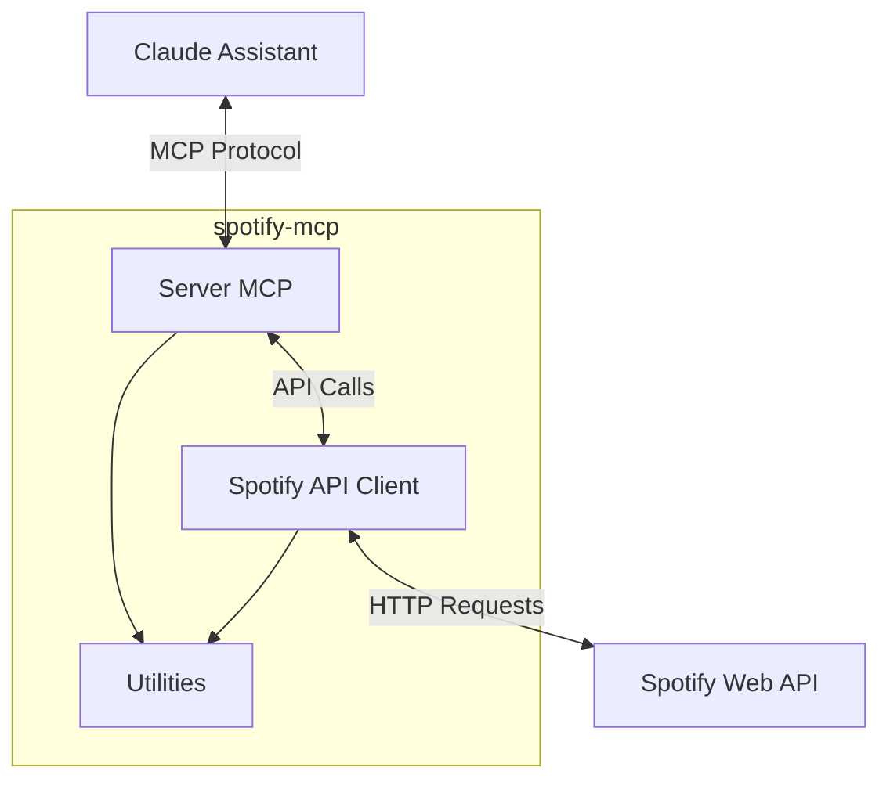
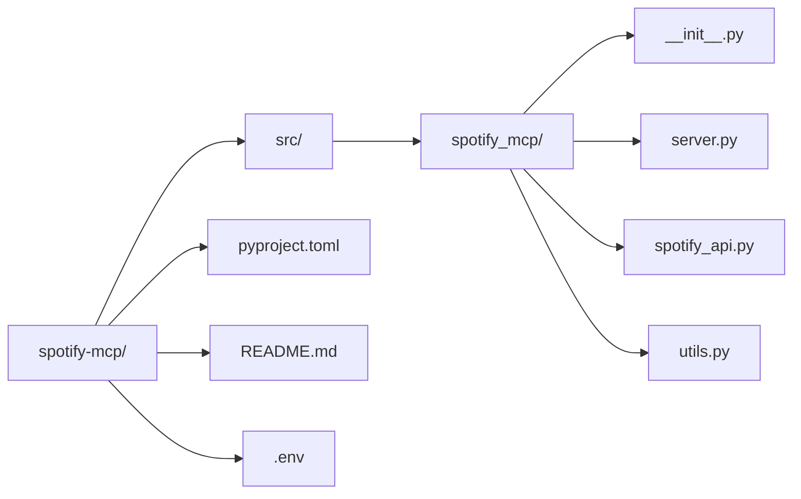
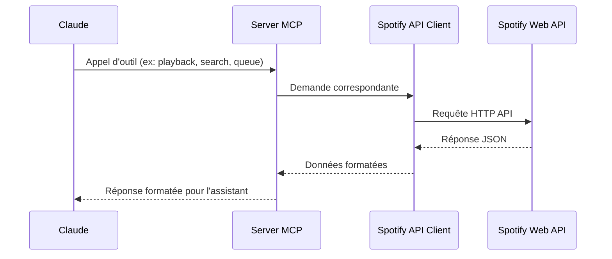
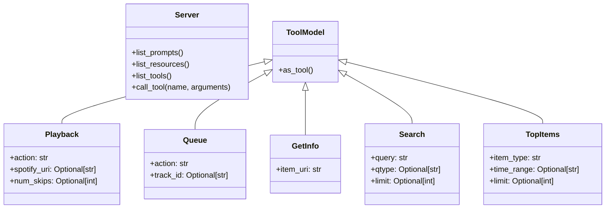
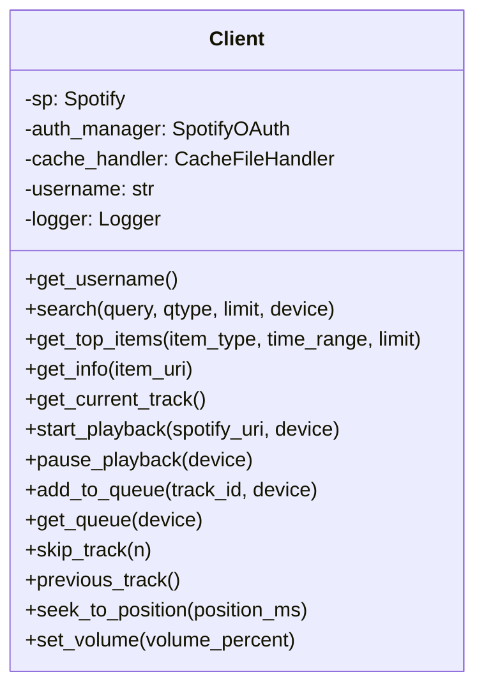
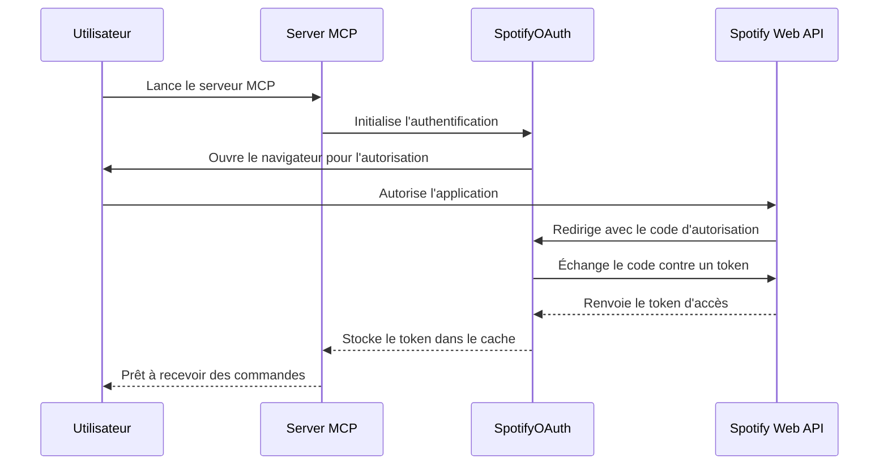

# Architecture du Projet spotify-mcp

Ce document présente l'architecture du projet spotify-mcp, un serveur MCP (Model Context Protocol) permettant à Claude d'interagir avec l'API Spotify.

## Vue d'ensemble

spotify-mcp est un serveur MCP (Model Context Protocol) qui permet à Claude d'interagir avec Spotify. Il utilise la bibliothèque spotipy pour communiquer avec l'API Spotify et expose des fonctionnalités comme la lecture, la pause, la recherche de musique et la gestion de la file d'attente.

## Diagramme de composants

## Structure du projet

## Flux de données

## Classes principales

### Modèle de classe pour server.py

### Modèle de classe pour spotify_api.py

## Fonctionnalités principales

1. **Lecture et contrôle**
   - Démarrer, mettre en pause, passer à la chanson suivante
   - Obtenir des informations sur la piste en cours
   - Gérer la file d'attente Spotify

2. **Recherche et découverte**
   - Rechercher des pistes, albums, artistes, playlists
   - Obtenir des informations détaillées sur un élément Spotify
   - Obtenir les éléments préférés de l'utilisateur (artistes, pistes)

## Flux d'authentification

## Interface MCP

Le projet implémente le protocole MCP (Model Context Protocol) qui permet à Claude d'interagir avec des outils externes. Les outils exposés incluent:

1. **playback** - Contrôle de la lecture
2. **queue** - Gestion de la file d'attente
3. **get_info** - Obtention d'informations sur un élément Spotify
4. **search** - Recherche d'éléments sur Spotify
5. **top_items** - Obtention des éléments préférés de l'utilisateur

## Dépendances

Les principales dépendances du projet sont:
- mcp==1.3.0 - Bibliothèque pour implémenter le protocole MCP
- python-dotenv>=1.0.1 - Pour gérer les variables d'environnement
- spotipy==2.24.0 - SDK Python pour l'API Spotify 