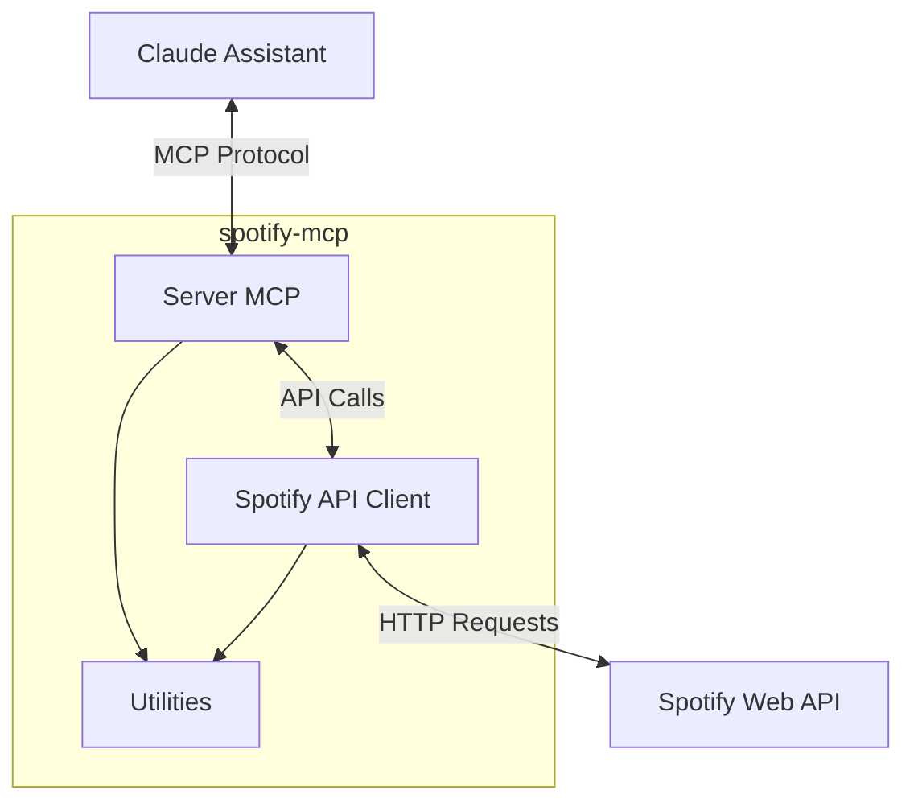

# Analyse Technique du Spotify Model Context Protocol (MCP)

## Introduction

Le Spotify Model Context Protocol (MCP) est une implémentation innovante permettant à l'assistant Claude d'interagir directement avec l'API Spotify. Cette solution technique offre une interface robuste entre les capacités de l'IA et les fonctionnalités de streaming musical de Spotify.

## Architecture Technique

### Vue d'ensemble

L'architecture du projet repose sur trois composants principaux :
1. Un serveur MCP (Model Context Protocol)
2. Un client API Spotify
3. Des utilitaires de support

L'interaction entre ces composants suit un modèle en couches bien défini, où chaque requête traverse la chaîne suivante :
```Claude → Serveur MCP → Client Spotify API → API Web Spotify```



### Composants Clés

#### 1. Serveur MCP (`server.py`)
Le serveur MCP agit comme point d'entrée principal et expose cinq outils fondamentaux :
- `playback` : Contrôle de lecture (play, pause, skip)
- `queue` : Gestion de la file d'attente
- `get_info` : Récupération des métadonnées
- `search` : Recherche dans le catalogue Spotify
- `top_items` : Accès aux éléments favoris de l'utilisateur
- `playlistcreator` : Crée une playlist et permet d'y ajouter des titres 

#### 2. Client Spotify (`spotify_api.py`)
Le client API encapsule toute la logique d'interaction avec Spotify via la bibliothèque `spotipy`. Il gère :
- L'authentification OAuth
- La mise en cache des tokens
- Les appels API
- La gestion des erreurs

### Flux d'Authentification

Le processus d'authentification suit le protocole OAuth 2.0 :
1. Initialisation du serveur MCP
2. Ouverture du navigateur pour autorisation utilisateur
3. Échange du code d'autorisation contre un token
4. Mise en cache du token pour les futures requêtes

## Fonctionnalités Techniques

### 1. Contrôle de Lecture
```python
class Playback(ToolModel):
    action: str
    spotify_uri: Optional[str]
    num_skips: Optional[int]
```
Permet le contrôle granulaire de la lecture avec :
- Démarrage/pause de la lecture
- Navigation entre les pistes
- Contrôle du volume
- Positionnement dans la piste

### 2. Gestion de File d'Attente
```python
class Queue(ToolModel):
    action: str
    track_id: Optional[str]
```
Offre des capacités de :
- Ajout de pistes à la file
- Consultation de la file
- Manipulation de l'ordre de lecture

### 3. Système de Recherche
```python
class Search(ToolModel):
    query: str
    qtype: Optional[str]
    limit: Optional[int]
```
Implémente une recherche multi-critères pour :
- Pistes
- Albums
- Artistes
- Playlists

### 4. TopItems

#### Structure
```python
class TopItems(ToolModel):
    """Get the user's top artists or tracks based on calculated affinity."""

    item_type: str = Field(
        description="Type of items to retrieve ('artists' or 'tracks')"
    )
    time_range: Optional[str] = Field(
        default="long_term",
        description="Time period over which to retrieve top items: 'long_term' (~ 1 year), 'medium_term' (~ 6 months), or 'short_term' (~ 4 weeks)",
    )
    limit: Optional[int] = Field(
        default=10, description="Number of items to retrieve (max 50)"
    )
```

#### Fonctionnalités
- **Type d'éléments** : Permet de récupérer soit les artistes (`artists`) soit les morceaux (`tracks`) les plus écoutés
- **Périodes d'analyse** :
  - `long_term` : Environ 1 an d'historique
  - `medium_term` : Environ 6 mois d'historique
  - `short_term` : Environ 4 semaines d'historique
- **Limitation** : Possibilité de définir le nombre d'éléments à récupérer (max 50)

#### Implémentation
Dans le gestionnaire d'outils (`handle_call_tool`), TopItems est traité comme suit :
```python
case "TopItems":
    item_type = arguments.get("item_type", "artists")
    time_range = arguments.get("time_range", "long_term")
    limit = arguments.get("limit", 10)

    top_items = spotify_client.get_top_items(
        item_type=item_type, 
        time_range=time_range, 
        limit=limit
    )

    return [
        types.TextContent(
            type="text", 
            text=json.dumps(top_items, indent=2)
        )
    ]
```

### 5. PlaylistCreator

#### Structure
```python
class PlaylistCreator(ToolModel):
    """Création et gestion des playlists Spotify"""

    action: str = Field(description="Action : 'create', 'search_and_add'")
    playlist_details: Optional[dict] = Field(
        description={
            "name": "Nom de la playlist",
            "description": "Description de la playlist",
            "public": "Visibilité (true/false)",
            "collaborative": "Playlist collaborative (true/false)",
        }
    )
    playlist_id: Optional[str] = Field(
        description="ID de la playlist (requis pour search_and_add)"
    )
    search_query: Optional[str] = Field(description="Recherche de titres à ajouter")
    limit: Optional[int] = Field(
        default=10, description="Nombre maximum de résultats de recherche"
    )
```

#### Fonctionnalités

##### 1. Création de Playlist (`create`)
- Crée une nouvelle playlist avec les paramètres suivants :
  - Nom (obligatoire)
  - Description (optionnel)
  - Visibilité publique/privée
  - Option collaborative
- Utilise l'API Spotify pour créer la playlist sous le compte de l'utilisateur actuel

##### 2. Recherche et Ajout (`search_and_add`)
- Permet d'ajouter des titres à une playlist existante
- Fonctionnalités avancées :
  - Recherche de playlist par ID ou par nom
  - Recherche de titres avec critères spécifiques
  - Gestion des erreurs détaillée
  - Logging des opérations

#### Implémentation Notable

##### Création de Playlist
```python
user_id = spotify_client.sp.current_user()["id"]
new_playlist = spotify_client.sp.user_playlist_create(
    user=user_id,
    name=details.get("name"),
    public=details.get("public", True),
    collaborative=details.get("collaborative", False),
    description=details.get("description", ""),
)
```

##### Recherche et Ajout de Titres
```python
# Recherche intelligente de playlist
if not playlist_id.startswith("spotify:playlist:") and not len(playlist_id) == 22:
    playlists = spotify_client.sp.current_user_playlists()
    for playlist in playlists["items"]:
        if playlist["name"] == playlist_id:
            playlist_id = playlist["id"]
            break

# Recherche de titre
sp_results = spotify_client.sp.search(
    q=search_query,
    type="track",
    limit=1,
    market="FR"
)

# Ajout à la playlist
track_uri = sp_results["tracks"]["items"][0]["uri"]
add_result = spotify_client.sp.playlist_add_items(
    playlist_id=playlist_id, 
    items=[track_uri]
)
```

#### Gestion des Erreurs
- Validation des entrées
- Gestion des cas d'erreur Spotify
- Logging détaillé des opérations
- Messages d'erreur explicites pour l'utilisateur

#### Points Forts
1. **Flexibilité** : Support de multiples actions et paramètres
2. **Robustesse** : Gestion complète des erreurs et des cas limites
3. **Traçabilité** : Logging détaillé des opérations
4. **Convivialité** : Messages clairs et retours d'information détaillés

## Aspects Techniques Notables

### Gestion des Erreurs
Le système implémente une gestion robuste des erreurs avec :
- Retry sur les erreurs réseau
- Gestion des expirations de token
- Logging détaillé des erreurs

### Performance
Optimisations notables :
- Mise en cache des tokens d'authentification
- Limitation des requêtes API
- Gestion efficace des ressources

### Extensibilité
L'architecture modulaire permet :
- L'ajout facile de nouveaux outils
- La modification des comportements existants
- L'intégration de nouvelles fonctionnalités Spotify

## Conclusion

Le Spotify MCP représente une solution technique élégante pour l'intégration entre les assistants IA et Spotify. Son architecture modulaire, sa gestion robuste des erreurs et ses fonctionnalités complètes en font un outil puissant pour le contrôle programmatique de Spotify.

## Stack Technique
- Python 3.12
- FastAPI
- Spotipy 2.24.0
- MCP 1.3.0
- Python-dotenv

---

_Note : Cet article est basé sur l'analyse de l'architecture et du code source du projet spotify-mcp._
